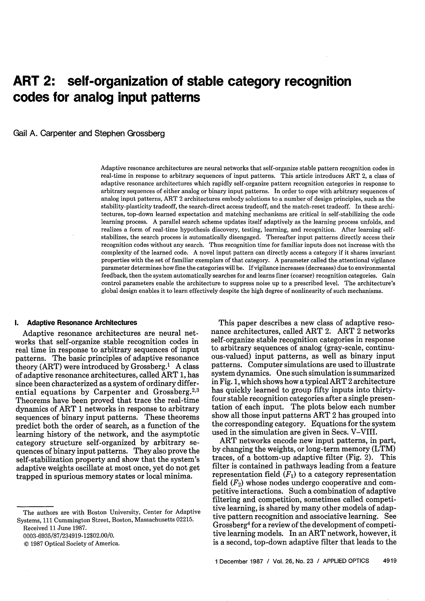
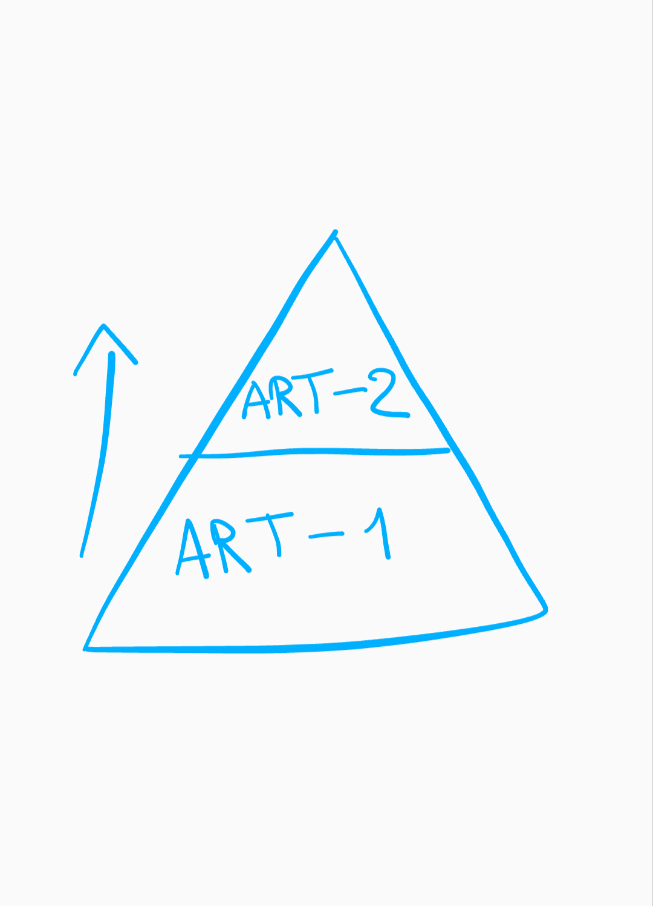
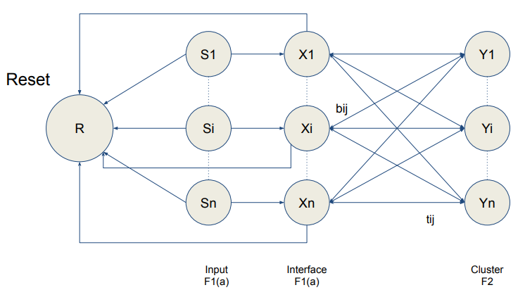
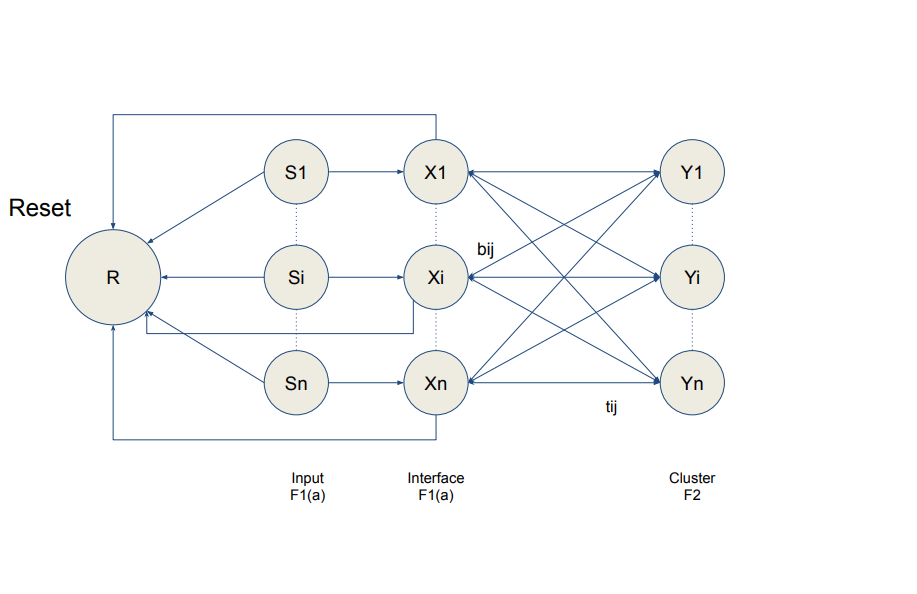
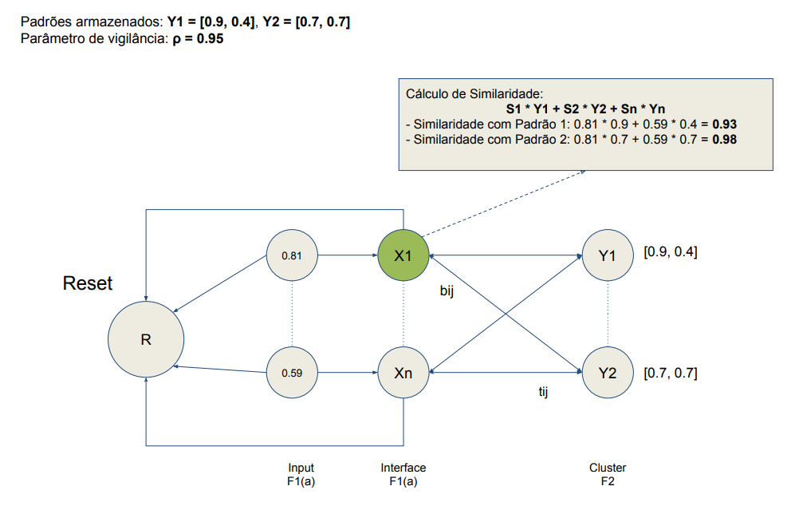
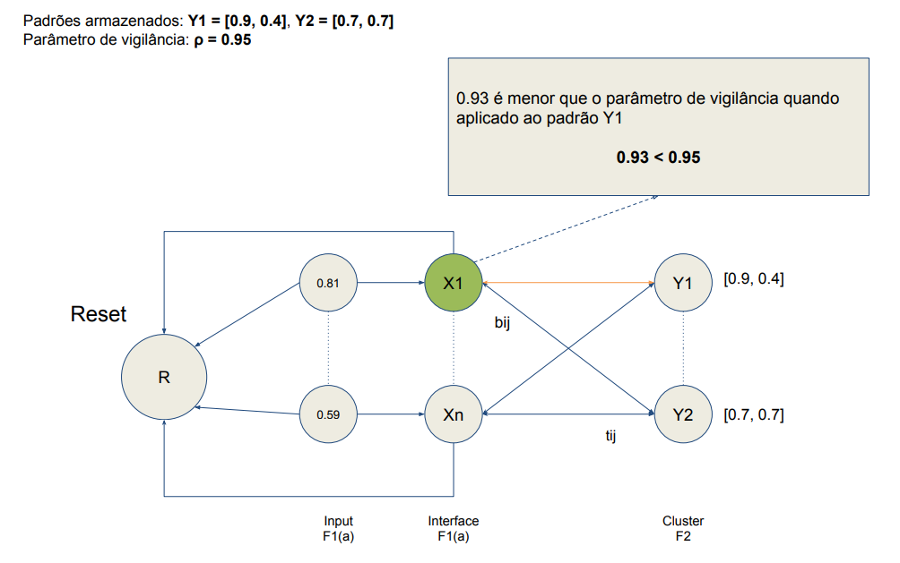
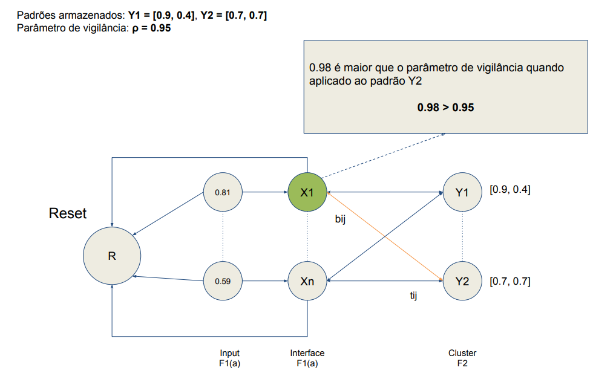
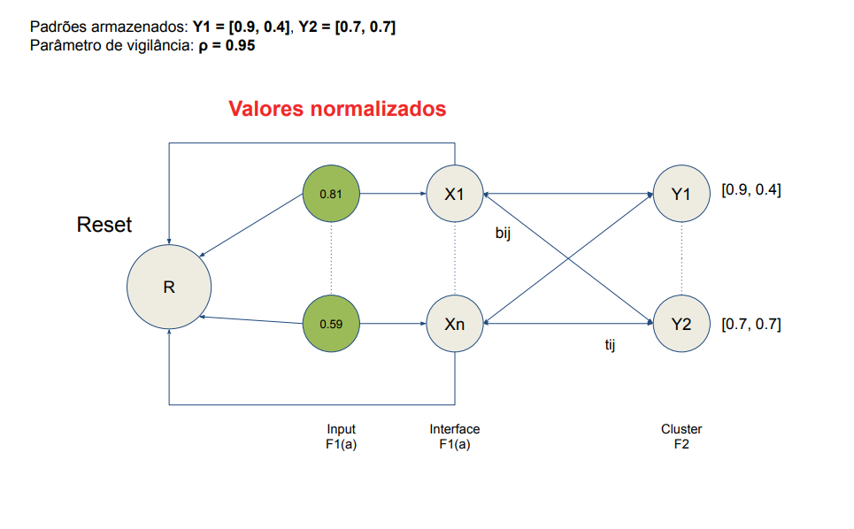

# Produto Educacional ART - 2

## Disciplina de Redes Neurais Artificiais

---

# Introdução ao Produto Educacional

- **Objetivo Geral:** Explorar a teoria e a prática associadas a ART-2, sua estrutura, princípio de ressonância adaptativa, aprendizado e algoritmo. O produto final incluirá pílulas de vídeo didáticas, infográficos
  e um projeto prático.

---

# Introdução ao Produto Educacional

- **Formato:**
  - Pílulas de vídeo curtas e didáticas.
  - Slides explicativos.
  - Projeto prático com código comentado em Python.

---

# Introdução às Redes ART-2 e Comparação com ART-1

## Uma Jornada pelas Redes Neurais Adaptativas

---

# O que são Redes ART?

As Redes de **Ressonância Adaptativa** são um tipo de `rede neural artificial não supervisionada` desenvolvida por **Stephen Grossberg** e **Gail Carpenter**. Elas se destacam por sua capacidade de aprendizado incremental, estabilidade-plasticidade e agrupamento de padrões sem a necessidade de definir o número de clusters a priori.

> Existem diversas variantes de redes ART, cada uma projetada para lidar com diferentes tipos de dados de entrada.

---

# ART-1: A Base para Dados Binários

A ART-1, a primeira variante da família ART, foi projetada para processar entradas binárias (0 ou 1). Ela opera com base em dois subsistemas principais:

- **Camada de Comparação (F1):** Recebe a entrada e a compara com os protótipos existentes na camada de reconhecimento.
- **Camada de Reconhecimento (F2):** Armazena os protótipos dos clusters aprendidos.

---

# ART-1: A Base para Dados Binários

A ART-1 utiliza um parâmetro crucial chamado **vigilância**, que controla a similaridade mínima necessária para um padrão de entrada ser associado a um cluster existente. Se a similaridade for inferior à vigilância, um novo cluster é criado.

---

# Limitações da ART-1 e a Necessidade da ART-2

Apesar de suas vantagens, a ART-1 apresenta uma limitação significativa: ela só pode processar dados binários. Em muitos cenários do mundo real, os dados são contínuos, o que motivou o desenvolvimento da ART-2.

<iframe id="dede" src="https://www.desmos.com/calculator/gugok9tmrq?embed" width="100%" height="500" frameborder=0></iframe>

---

# ART-2: Expandindo para Dados Contínuos

A ART-2 foi projetada para superar a limitação da ART-1, permitindo o processamento de entradas contínuas. Para isso, ela incorpora mecanismos de normalização e pré-processamento dos dados antes da comparação com os protótipos. A arquitetura da ART-2 é mais complexa que a da ART-1, incluindo etapas adicionais para lidar com ruído e garantir a estabilidade do aprendizado.

---

# Comparação ART-1 vs. ART-2

| Característica        | ART-1                                             | ART-2                                                                         |
| --------------------- | ------------------------------------------------- | ----------------------------------------------------------------------------- |
| **Tipo de Entrada**   | Binária                                           | Contínua                                                                      |
| **Complexidade**      | Menor                                             | Maior                                                                         |
| **Pré-processamento** | Não necessário                                    | Necessário (normalização, supressão de ruído)                                 |
| **Parâmetros**        | Vigilância                                        | Vigilância, outros parâmetros de pré-processamento                            |
| **Aplicações**        | Dados binários, reconhecimento de imagens simples | Dados contínuos, processamento de sinais, reconhecimento de padrões complexos |

---

# ART-2-A: Uma Simplificação Eficiente

A ART-2-A é uma versão simplificada da ART-2 que mantém a capacidade de lidar com entradas contínuas, mas com uma arquitetura menos complexa e menor custo computacional. A ART-2-A se torna uma alternativa interessante em cenários onde a performance é crucial.

---

# Conclusão

As redes ART, em suas diferentes variantes, oferecem uma abordagem interessante para o aprendizado não supervisionado. A ART-1, com sua simplicidade, é adequada para dados binários, enquanto a ART-2 e a ART-2-A estendem essa capacidade para dados contínuos, embora com maior complexidade. A escolha da variante adequada depende das características dos dados e dos requisitos da aplicação. É importante lembrar que, apesar de suas vantagens, as redes ART também possuem limitações, como a sensibilidade aos parâmetros e a dificuldade de lidar com datasets muito grandes, como explorado no documento anterior.

---

# Estrutura Topológica, Princípios e Algoritmo de Treinamento da Rede ART-2

## Desvendando a Arquitetura da ART-2

---

# Topologia da ART-2

---

# Topologia da ART-2

A ART-2 possui uma estrutura mais complexa que a ART-1, projetada para processar entradas contínuas. Ela é composta pelos seguintes componentes principais:

- **Camada de Entrada (F0):** Recebe o vetor de entrada **I** e o normaliza.
- **Camada de Comparação (F1):** Compara a entrada normalizada com os protótipos existentes na camada de reconhecimento (F2).
- **Camada de Reconhecimento (F2):** Armazena os protótipos dos clusters. Cada nó em F2 representa um cluster.
- **Mecanismo de Reset:** Responsável por controlar a criação de novos clusters quando a similaridade entre a entrada e os protótipos existentes é insuficiente.

Além dessas camadas principais, a ART-2 inclui diversos componentes intermediários que realizam operações de normalização, supressão de ruído e comparação.

---

---

# Princípios de Funcionamento

A ART-2 opera com base nos seguintes princípios:

---

- **Ressonância:** Quando um padrão de entrada é apresentado, a rede busca um protótipo em F2 que seja suficientemente similar. Se a similaridade for alta o suficiente (controlada pelo parâmetro de vigilância), ocorre a ressonância, e o protótipo é atualizado para se aproximar ainda mais da entrada.
- **Reset:** Se nenhum protótipo existente for suficientemente similar à entrada, o mecanismo de reset é ativado, e um novo cluster é criado com a entrada como protótipo.
- **Aprendizado Incremental:** A ART-2 aprende de forma incremental, ajustando os protótipos a cada nova entrada sem esquecer os padrões aprendidos anteriormente.
- **Estabilidade-Plasticidade:** O parâmetro de vigilância controla o equilíbrio entre estabilidade (manutenção dos clusters existentes) e plasticidade (capacidade de criar novos clusters).

---

# Algoritmo de Treinamento

O algoritmo de treinamento da ART-2 pode ser resumido nos seguintes passos:

---

1. **Inicialização:** Inicializar os pesos da rede e definir o parâmetro de vigilância (ρ).
2. **Apresentação da Entrada:** Apresentar um vetor de entrada **I**.
3. **Normalização:** Normalizar o vetor de entrada em F0.
4. **Comparação:** Calcular a similaridade entre a entrada normalizada e os protótipos em F2.

---

---

---

5. **Ressonância ou Reset:**
   - **Ressonância:** Se a similaridade for maior ou igual à vigilância (ρ), atualizar o protótipo vencedor em F2 para se aproximar da entrada.
   - **Reset:** Se a similaridade for menor que ρ, inibir o protótipo vencedor e repetir o processo de comparação com os demais protótipos. Se nenhum protótipo atender ao critério de vigilância, criar um novo cluster com a entrada como protótipo.
6. **Repetir:** Repetir os passos 2 a 5 para todos os vetores de entrada.

---

---

---

# Detalhes do Pré-processamento e Comparação (F1)

Camada F1 realiza pré-processamento e comparação, incluindo normalização, supressão de ruído e cálculo da similaridade entre a entrada e os protótipos. Estas operações, essenciais para o funcionamento da ART-2 com dados contínuos.

---

# Conclusão

A ART-2 é uma rede neural complexa, mas poderosa, para aprendizado não supervisionado com dados contínuos. Sua arquitetura, princípios de funcionamento e algoritmo de treinamento são fundamentais para entender seu comportamento e suas aplicações. A compreensão desses aspectos permite uma melhor utilização e ajuste da rede para diferentes problemas. A próxima seção explorará as vantagens e desvantagens da ART-2, bem como suas aplicações práticas.

---

# Aspectos de Implementação Prática e Início do Projeto Prático

## Colocando a ART-2 em Ação

---

# Desafios da Implementação

Implementar a ART-2 na prática apresenta alguns desafios:

- **Complexidade do Algoritmo:** A ART-2 possui um algoritmo mais intrincado que outras redes neurais, exigindo atenção aos detalhes de normalização, supressão de ruído e o mecanismo de reset.
- **Escassez de Bibliotecas:** Diferente de redes mais populares como MLPs, a ART-2 não possui implementações robustas e amplamente disponíveis em bibliotecas populares como TensorFlow ou PyTorch.
- **Ajuste de Parâmetros:** A performance da ART-2 é sensível aos seus parâmetros, especialmente à vigilância (ρ). Encontrar os valores ideais para um determinado problema pode exigir experimentação e ajustes finos.

---

# Abordagens de Implementação

Apesar dos desafios, existem algumas abordagens para implementar a ART-2:

---

- **Implementação do Zero:** Construir a ART-2 a partir do zero, utilizando linguagens como Python com bibliotecas numéricas como NumPy. Essa abordagem oferece maior controle sobre o algoritmo, mas requer um esforço significativo de desenvolvimento e depuração.
- **Adaptação de Código Existente:** Utilizar implementações disponíveis online como ponto de partida e adaptá-las às necessidades do projeto. Essa abordagem pode economizar tempo, mas requer cuidado para garantir a correção e a eficiência do código.
- **Bibliotecas Especializadas (se disponíveis):** Pesquisar por bibliotecas menos conhecidas que possam oferecer implementações da ART-2 ou de variantes dela.

---

# Início do Projeto Prático: Clusterização com ART-2

O projeto prático visa implementar a ART-2 para clusterização de um conjunto de dados. Os passos iniciais incluem:

---

1. **Escolha do Conjunto de Dados:** Selecionar um conjunto de dados apropriado para clusterização, com dados contínuos e um número razoável de amostras e dimensões. Considerar conjuntos de dados de benchmark ou dados relevantes para a área de interesse.
2. **Pré-processamento dos Dados:** Normalizar os dados para garantir que estejam na faixa adequada para a ART-2. Remover ruídos ou outliers se necessário.
3. **Implementação da ART-2:** Escolher uma das abordagens de implementação mencionadas anteriormente e iniciar o desenvolvimento do código.
4. **Definição dos Parâmetros:** Definir valores iniciais para os parâmetros da ART-2, incluindo a vigilância (ρ).
5. **Treinamento e Avaliação:** Treinar a ART-2 com o conjunto de dados pré-processado e avaliar a qualidade da clusterização utilizando métricas apropriadas, como o índice de Rand ajustado ou a silhueta.

---

## Durante o desenvolvimento e experimentação com ART-2, diversos problemas foram identificados:

---

- **Ineficácia com Grandes Conjuntos de Dados:**

  - A rede ART-2 não se comporta bem em bases de dados extensas.

- **Desempenho Inferior a Outras Arquiteturas:**

  - Comparada a um MLP padrão, os resultados foram consistentemente piores.

- **Dificuldade de Implementação:**

  - Não há frameworks populares (como PyTorch) que suportem ART-2 diretamente.
  - Implementações existentes são escassas e muitas vezes subótimas.

- **Sensibilidade a Ruídos e Parâmetros:**
  - A calibração de parâmetros (como vigilância) é complexa e impacta diretamente os resultados.

---

> **Nota:** Até mesmo autores da ART-2 reconhecem essas limitações, sugerindo que sua aplicabilidade é restrita.

---

# ART2: Uma Análise Crítica no Contexto do Aprendizado de Máquina

Este documento apresenta uma análise da rede neural ART2 considerando suas vantagens, limitações, e sua adequação em diferentes contextos de aprendizado de máquina, contrastando-a com experiências práticas e comparando-a com outras arquiteturas.

---

**Aplicações:** A ART2-A encontra aplicações em diversos domínios, incluindo:

- **Processamento de Sinais:** Análise de áudio, vídeo e sinais biomédicos.
- **Controle de robótica:** Tomada de decisão em ambientes dinâmicos e imprevisíveis.
- **Entre outros**

---

# Conclusão: Escolhendo a Arquitetura Adequada

A ART2 oferece uma abordagem única para determinados problemas de aprendizado de máquina. No entanto, sua eficácia depende muito das características do dataset, da ordem de aprendizado dos dados, da sua dimensionalidade, e de seus parâmetros sendo uma dependencia bem complicada segundo o testado. É essencial avaliar cuidadosamente as suas limitações, especialmente em relação à escalabilidade e à sensibilidade a parâmetros, antes de optar por sua utilização. Em muitos casos, outras técnicas podem ser mais adequadas e eficientes, e o desenvolvimento de aplicações com ART2 costuma exigir mais tempo e esforço do que com arquiteturas mais populares.
